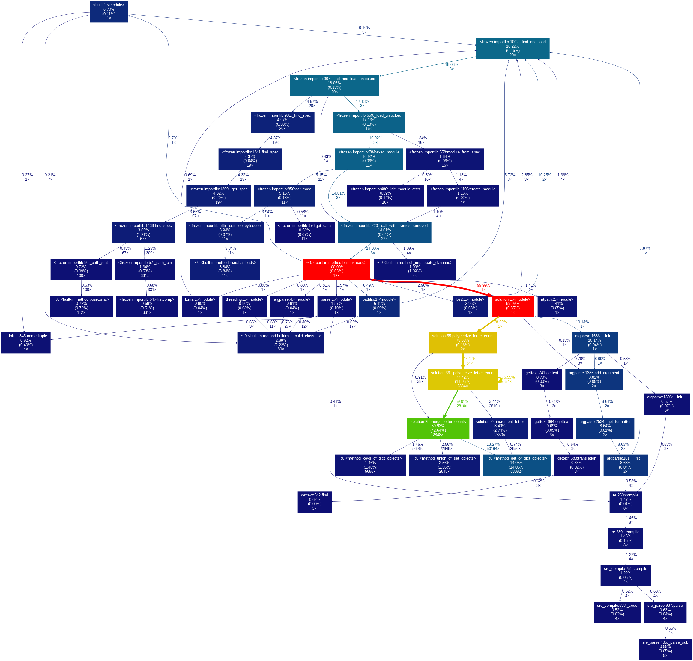
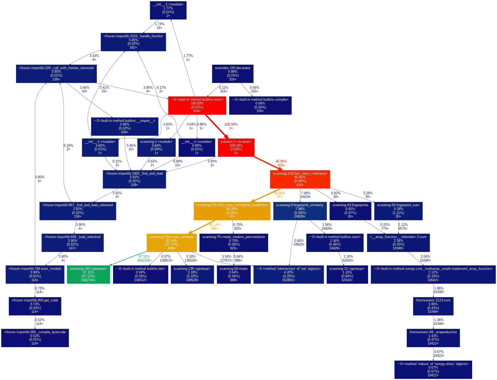

# Solutions to problems in Advent of Code 2021 using Python 

See https://adventofcode.com/2021 for more information about Advent of Code 2021.

## Day 14
This one was a bit tricky. I had to use memoization / caching to reduce the function calls enough (after a tip from a friend).
Here is a benchmark of the final solution using cProfile and gprof2dot that was generated with the following commands ([taken from here](https://github.com/emanuelen5/rpi-led-server/blob/master/doc/benchmarks.md)):

```bash
python -m cProfile -o profile.dat days/14/solution.py 2>/dev/null
gprof2dot -f pstats profile.dat | dot -Tpng | display
```

Note that the polymerization function was only called 2884 times (which is kind of the key).




## Day 19
This one was mighty hard... I had to look on reddit for some tips on how to speed up the algorithm, and not have to brute-force the whole searches (reject some combinations early).
By using some of their tips, I managed (without having solved the whole problem yet) to reduce the computations from an unfathomable hour down to 3 seconds, by computing "fingerprints" for each sensor array. The fingerprint is the distance between the beacons (instead of their location relative to the sensor itself). This is independent of where the sensor is, and quite unique for a set of beacons, which makes it possible to reject a whole lot of solutions early.


